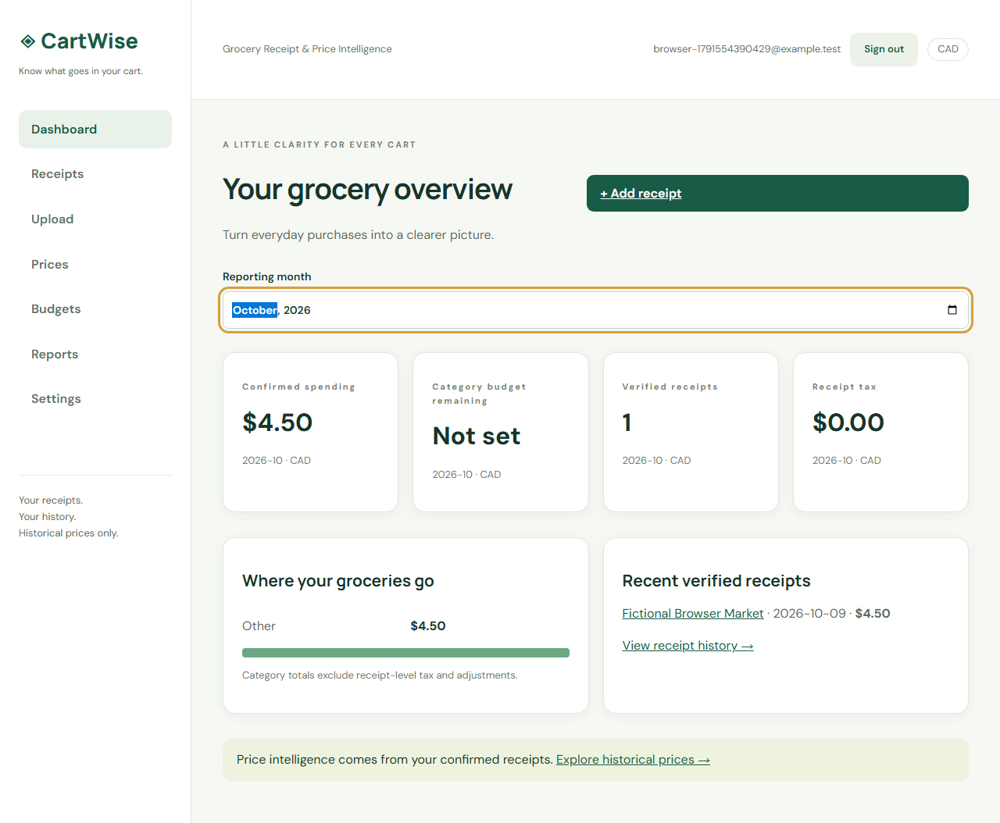
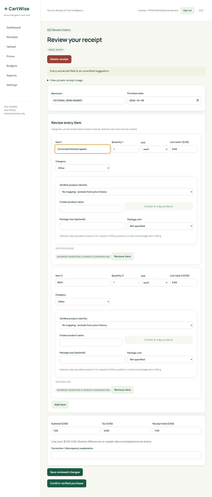

# CartWise — Grocery Receipt & Price Intelligence

A full-stack grocery notebook: upload a receipt, correct local OCR suggestions, confirm the purchase, and understand your spending and **your own historical prices**. Built with React/TypeScript/Vite, Express, Prisma/SQLite, Sharp and Tesseract.js. No live retailer feeds or paid AI services.



## Run locally

Requires Node 22.13.1 or newer compatible Node 22 LTS and npm. SQLite is embedded; no database server is needed.

```sh
npm ci
```

Copy `backend/.env.example` to `backend/.env` (PowerShell: `Copy-Item backend/.env.example backend/.env`; macOS/Linux: `cp backend/.env.example backend/.env`). Then:

```sh
npm run db:migrate
npm run db:seed
npm run dev
```

Open **http://127.0.0.1:5173**. API: http://127.0.0.1:3001/api/health. Use the same hostname throughout to preserve cookie/origin checks. `APP_ORIGIN` must match the browser URL. The seed/release setup is finalized in roadmap milestone 50; check [the progress ledger](docs/PROGRESS.md) for the latest verified state.

Fictional demo account: `demo@cartwise.test` / `CartWise-demo-2026!`. Register your own local account if preferred. Seeded dates use the current local month, and all stores/products are clearly fictional. Demo credentials are public fixtures, not production secrets.

Run services separately with `npm run dev -w backend` and `npm run dev -w frontend`. Development data is in `backend/prisma/dev.db`; image/OCR cache storage is private under `backend/storage/`. Files are gitignored.

## Working features

- Registration, login/logout, salted scrypt passwords, hashed expiring/revocable sessions and guarded routes.
- Private, validated JPG/PNG/WebP uploads; real local English OCR in a single-worker queue; processing/failure states and bounded retry.
- Manual entry and human correction of merchant, local date, item names, quantities, categories, packages and totals. Explicit confirmation gates analytics.
- Exact original-file hash and cautious merchant/date/total duplicate warnings; idempotent transactional confirmation.
- Filtered, paginated receipt history, private image preview and receipt deletion with derived-data cleanup.
- Explicit canonical product mapping, exact decimal unit normalization and source-linked historical price/store comparisons.
- Monthly spending dashboard, category budgets, tax-aware reports and accessible chart tables.
- Safe confirmed-receipt CSV, account JSON export, image retention preference and password-verified account deletion.



## Verify

```sh
npm run lint
npm run typecheck
npm test
npm run build
npm run test:ocr
npx playwright install chromium
npm run test:e2e
```

Local verification before release: **21 unit/integration/React tests across 17 files passed**, both production builds passed, and **one Chromium E2E passed**, including actual local Tesseract recognition. Final release verification is recorded in [PROGRESS.md](docs/PROGRESS.md). Test databases (`test.db`, `e2e.db`) are separate from development data. E2E starts local services if none are running; it reuses an existing development server locally, so run it with servers stopped for full database isolation. GitHub Actions performs these checks on pushes/PRs; its hosted result is not claimed until observed.

The first actual OCR run downloads public English language data into a private cache. Subsequent OCR runs can use the cache offline. Deterministic parser tests need no model download. Generated fixtures are in `backend/fixtures/`; all are deliberately fictional.

## Financial and privacy rules

All persisted CAD money uses integer cents. Positive quantities are decimal strings. kg/g and L/ml normalize within their measurement family; products with incompatible units cannot be compared. Unit-price display strings round half-up to six decimal cents per base unit.

Receipt spending includes tax; category budgets use reviewed line totals excluding receipt-level tax/adjustments. Discrepancies require correction or an explicit explanation. Confirmed receipts are immutable; delete/re-enter for corrections. OCR confidence is heuristic, not a measured probability.

Receipt images can contain private details. Storage is private, generated names are constrained, account ownership is enforced, and images are deleted after confirmation by default. Pending images remain until receipt/account deletion. Retention settings cannot recover deleted images. Use synthetic receipts for public demos.

## Architecture, demo and limitations

- [Architecture and security decisions](docs/ARCHITECTURE.md)
- [Actual REST API contracts](docs/API.md)
- [90-second demo walkthrough](docs/DEMO.md)
- [Release/deployment notes](docs/DEPLOYMENT.md)
- [Roadmap and resumable verification ledger](docs/PROGRESS.md)

This is a local portfolio application, with no deployment or measured OCR accuracy claimed. OCR layout handling is limited and corrections are expected. CAD only; no PDF ingestion. One-process OCR can be interrupted by restart and requires retry; it is not a distributed queue. Price APIs cap historical results at 1,000 observations. No live retailer prices, banking, production certification or automated fuzzy product merging.
