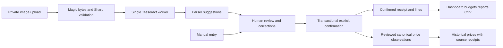

# Architecture and engineering decisions

CartWise is one Express process and a React SPA backed by Prisma/SQLite. Data belongs to one authenticated account. All bundled receipts and screenshots are fictional.

## Code responsibilities

- `backend/src/controllers/`: request validation, authenticated routes, HTTP responses.
- `backend/src/services/`: sessions/passwords, private files, OCR, transactional review and reporting.
- `backend/src/domain/`: cents/date validation, deterministic parser, decimal normalization, CSV escaping and comparable price grouping.
- `backend/prisma/`: relational schema and committed incremental migrations. Foreign keys cascade account/receipt deletion; product deletion removes observations and unlinks receipt lines.
- `frontend/src/`: routed screens, typed HTTP client, reusable controls and editable review form.

SQLite makes local reproduction straightforward. Transactions and source-line uniqueness prevent duplicate observation sets. This is a single-process application; scale would require durable OCR jobs and a shared database/storage design before running multiple instances.

## Money, quantities and tax

CAD values persist as integer cents, capped at 999,999,999 cents per field. No balances persist as floating-point dollars. Currency inputs convert decimal digits to cents. Decimal.js handles quantity normalization with precision 40. kg→g and L→ml conversions are exact. Package size applies only to `each` quantities, and requires both size and unit. Positive quantities allow six fractional digits.

Derived unit price is a decimal **string**, rounded half-up to six fractional cents per base unit; it is a display/comparison value, not a stored balance. UI chart widths and currency formatting may use numbers for presentation. A canonical product has one measurement family. Confirmation rejects mismatched mappings. Product identity is explicitly reviewed and never automatically fuzzy-merged.

Receipt totals include tax. Category budgets sum reviewed line totals and exclude receipt-level tax and adjustments. Reports show tax and the unallocated difference separately. Inconsistent subtotal/line sums or subtotal+tax/total require correction or an explanation of at least ten characters. No automatic balancing values are invented. Confirmed receipts are immutable: corrections require deleting and re-entering the receipt; the latest draft correction explanation remains on the receipt. Deletion removes derived prices/reports too.

## OCR reliability

Tesseract.js performs actual local English OCR. First use downloads the public English language model; it is cached under private `storage/ocr-cache`. The parser tests use synthetic text for determinism. `npm run test:ocr` regenerates a fictional legible image and checks recognizable product/total text. This is a smoke check, not a measured accuracy benchmark.

One queue drains one worker at a time. Recognition has a 90-second timeout, safe error codes and at most three retry attempts. Live engine progress is shown per processing stage, rather than inventing an overall completion estimate. Worker initialization can depend on the language download. On startup interrupted processing records become failed, ready for user retry/correction. There is no distributed queue. Restarting can interrupt OCR. Suggestions, confidence values and parsed quantities are heuristic and unverified. OCR never imports confirmed purchases.

## Privacy and access controls

Passwords use salted Node scrypt. Random 256-bit session tokens exist only in HttpOnly SameSite=Strict cookies; SHA-256 token hashes persist with seven-day expiry and revocation. Login rotates the current session. Production cookies require HTTPS. State-changing calls require a custom header and reject a supplied mismatched Origin. No cross-origin CORS allowance is configured. Authentication and uploads are rate limited.

Every owner-owned receipt, image, product, budget and report query scopes to the session user ID. Unknown or foreign receipt IDs return 404. Validation is centralized with Zod and safe errors; raw OCR and passwords are not logged.

Uploads permit one JPG/PNG/WebP file up to 8 MB and 16 million decoded pixels. Magic bytes and claimed MIME must agree; Sharp decodes, strips metadata and saves PNG under a random UUID name. Paths are constrained to private storage, which is never exposed by static serving. Authenticated image responses use no-store caching.

Image retention defaults off: confirmed images/OCR suggestions are removed. Pending images remain for review/retry until deletion. Turning retention off deletes previously retained confirmed images. Account deletion checks the password, removes private images and cascades database records. JSON export omits password/session hashes, image paths and OCR text. Local backups/exported copies cannot be recalled. Unexpected crashes or filesystem failures can leave cleanup work; this is not a production compliance claim.

Exact duplicate detection uses the original uploaded-file hash scoped to the user. Merchant/date/total detection is only a warning. A user must acknowledge a distinct purchase explicitly; CartWise never silently merges or deletes fuzzy matches. CSV fields are quoted, escaped, and formula-like text receives a leading apostrophe.

## Tests and limits

The local quality gate currently passes 21 tests across 17 files plus one real Chromium workflow. Tests cover precision, parser corrections, date boundaries, duplicate upload, parallel confirmation, session expiry, privacy, unsafe files, confirmed-only analytics, budgets/export/deletion and React interactions. Browser screenshots show real running screens with fictional accounts. Hosted CI and deployment have not yet been demonstrated.

No live retail prices, PDF ingestion, automatic universal receipt-layout understanding, multiple currencies, bank integrations or production security certification are claimed.
